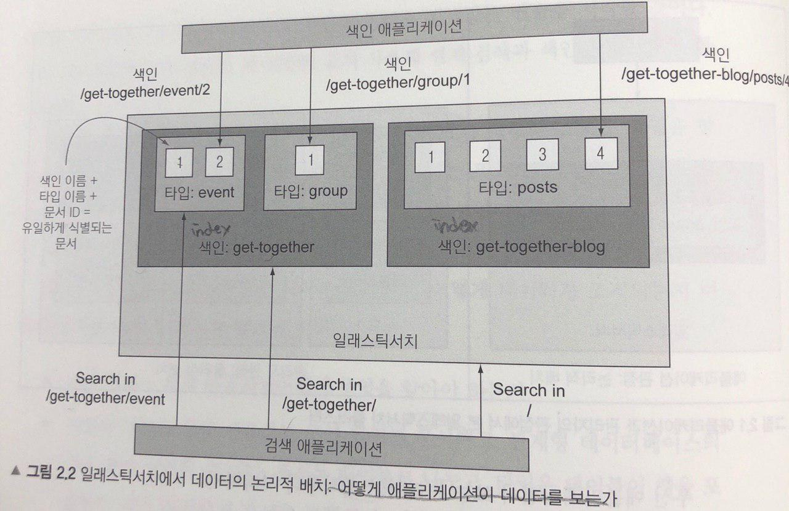

## 데이터 구조

### 논리적 배치(Application 관점) : 문서(document), 타입(type), 색인(index)

 - document
    - index, 검색의 최소한의 단위
    - JSON 형식의 document
        ~~~
        {
            "name" : "Elasticsearch Denver",
            "organizer" : "Lee",
            "location" : [
                "name" : "Denver, Colorado, USA",
                "geolocation" : "39.1231, -104.1241"
            ]
        }
        ~~~
    - document엔 스키마가 존재하지 않는다. 어떠한 형식이든 document 를 가질수 있다. -> schema-free

 - type
    - 테이블이 행에 대한 컨테이너인것과 같이 document 에 대한 논리적인 컨테이너다. -> document 모임

 - index
    - mapping type의 컨테이너이다. -> 다소 비슷한 특성을 가진 document의 모음
    - DB와 같이 독립적인 document덩어리 이다.
    - 디스크에 같은 파일 집합으로 저장됨.
    - refresh_interval 설정으로 간격 정의 가능. : refresh 비용은 꽤 비싼편으로 default 1초 (NRT)
    - 한개 혹은 N개의 샤드로 구성할 수 있다.
    - 하나 이상의 주 샤드와 0개 이상의 레플리카 샤드로 구성된다.

### 물리적 배치(관리자 관점) : 노드(node), 샤드(shard)
 - 어떻게 elasticsearch가 확장하는지 이해할 수 있다.

 - node
    - elasticsearch를 실행하는 프로세스
    - elasticsearch의 인스턴스
    - index들의 모임

 - shard
    - elasticsearch가 다루는 가장 작은 단위, 하나의 샤드는 하나의 루씬 색인 루씬 색인은 역 색인을 포함하는 파일들의 모음
    - index를 분할한 조각들.
    - 색인을 생성할 때 원하는 샤드 수를 간단히 정의할 수 있음
    - 각 샤드는 그 자체가 온전한 기능을 가진 독립적인 "index"이며, 클러스터의 어떤 노드에서도 호스팅할 수 있다.
    - 너무 적은 샤드는 확장에 제한을 주고 너무 많은 샤드는 성능에 영향을 준다.

### split brain
 - 클러스터의 두 파트가 통신할 수 없어서 다른 파트가 떨어져 나갔다고 판단하는 현상.
 - 노드가 충분히 빨라 서로간의 통신을 할 수 있도록 보장해야함.

### replica
 - 주 샤드의 정확한 복사본이다.
 - 항상 생성하거나 제거할 수 있다.
 - 검색성능과 장애복구에 이유를 둔다.

### elasticsearch URI 구조
~~~
-X{method} http://{host}:{port}/{index}/{type}/{documentid}
~~~

### 데이터 CRUD
| Elastic Search | Relational DB | CRUD |
|---|---|---|  
| GET | SELECT | READ |
| PUT | UPDATE | UPDATE |
| POST | INSERT | CREATE |
| DELETE | DELETE | DELETE |

### 필드 타입
| 기본 타입 | 예제 값 |
|---|---|
| String(->Text로~) | "Stringgggg" |  
| Numeric | 34, 1.4 |
| Date | 2015-02-24 |
| Boolean | true false |

### 매핑(mapping)
 - elasticsearch는 모든 필드와 타입, 그리고 다른 설정에 대한 매핑을 보관하고있다. 이 매핑은 index의 type마다 다르다.
 - 타입에서 지금까지 색인한 모든 문서의 모든 필드를 포함한다. 하지만 모든 문서가 모든 필드를 가질 필요는 없다.
 - 새로운 document가 매핑에 존재하지 않는 필드와 함께 색인하면 elasticsearch 는 자동으로 새로운 필드를 매핑에 추가한다.
 - 필드를 추가하기위해 타입이 무엇인지 추측하여 매핑한다.
  ex> "age" : 14 -> long 이군?
 - 필드를 자동으로 찾고 그것에 맞게 매핑을 조정한다.
 - 타입으로부터 document에 있는 모든 필드를 포함하고, document의 필드를 어떻게 색인할 것인지 elasticsearch에게 알려준다.
 - 매핑정보 보기
~~~
 index/_mapping/~~
~~~

### 도큐먼트 변경 (PUT)
 - 기존의 document를 변경하면 변경하는 document는 기존 document에 덮어쓰면서 조회, 처리, 재색인을 수반한다.
    - 기존도큐먼트 조회 : _source 필드를 활성화하여 활용
    - 명시된 변경 사항을 반영
    - 기존 document를 삭제하고 변경사항이 반영된 새 document를 색인

### 도큐먼트 변경에서의 동시성 문제
 - 하나의 변경이 원본 document를 가져와서 변경사항을 적용하는 동안 또 다른 하나의 변경이 document를 다시 색인하게 할 수 있다. -> 동시성 제어 필요
 - elasticsearch는 이 문제를 version 번호를 이용하여 해결함.
 - 하나의 변경을 실패처리하고 다음 버전으로 재실행한다.
 - 병렬작업을 허용하고 드물게 나타나는 충돌을 추정하여 해결 낙관적 잠금 (Optimistic locking)
 - 충돌을 야기하는 작업 자체를 막는 비관적 잠금(Pessimistic locking)

 - elasticsearch에서 자동으로 재시도하는 파라미터 retry_on_conflict
 ~~~
 curl -XPOST '{host}:{port}/{index}/{type}/{id}/_update?retry_on_conflict={version}'
 ~~~

### 데이터 삭제 (DELETE)
 - document 삭제 : 삭제할 대상을 검색시 보이지 않도록만 표시해서 나중에 비동기 방식으로 색인에서 삭제한다.
    - ID로 단일 document 삭제
    - 단일 요청으로 다수의 document 삭제 : bulk request를 사용
    - 매핑 타입 삭제, 매핑 타입 내에서 모든 document 삭제
    - 쿼리로 검색하는 모두 document 삭제

 - 완성된 색인 삭제 : document 그룹을 삭제하는 특수한 경우라서 성능을 고려해서 사용할만한 방식은 아니다. 색인과 연관된 모든 파일을 삭제한다. 거의 즉시 처리된다.

 - 색인 닫기 : 닫은 색인은 읽기나 쓰기 작업을 허용하지 않고 메모리에 올리지 않는다. elasticsearch에서는 삭제한것과 다름없지만 디스크에 남아있으므로 쉽게 복구가능.
    ~~~
    curl -XPOST '{host}:{port}/{index}/_close'
    ~~~
    ~~~
    curl -XPOST '{host}:{port}/{index}/_open'
    ~~~

### 기타 ~
 - elasticsearch는 데이터를 루씬 세그먼트에 저장한다. 한번 생성하면 변경하지 않는다.
 - document 삭제는 루씬 세그먼트가 비동기로 병합될 때 발생한다. 전체 색인 삭제가 하나 이상의 개별 document를 삭제하는것보다 빠른 이유는 병합없이 디스크에서 파일을 삭제할 수 있어서이다.
