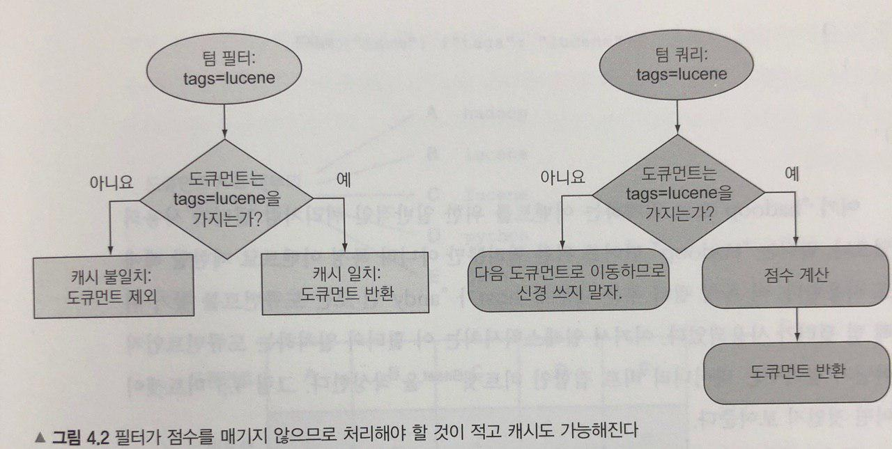
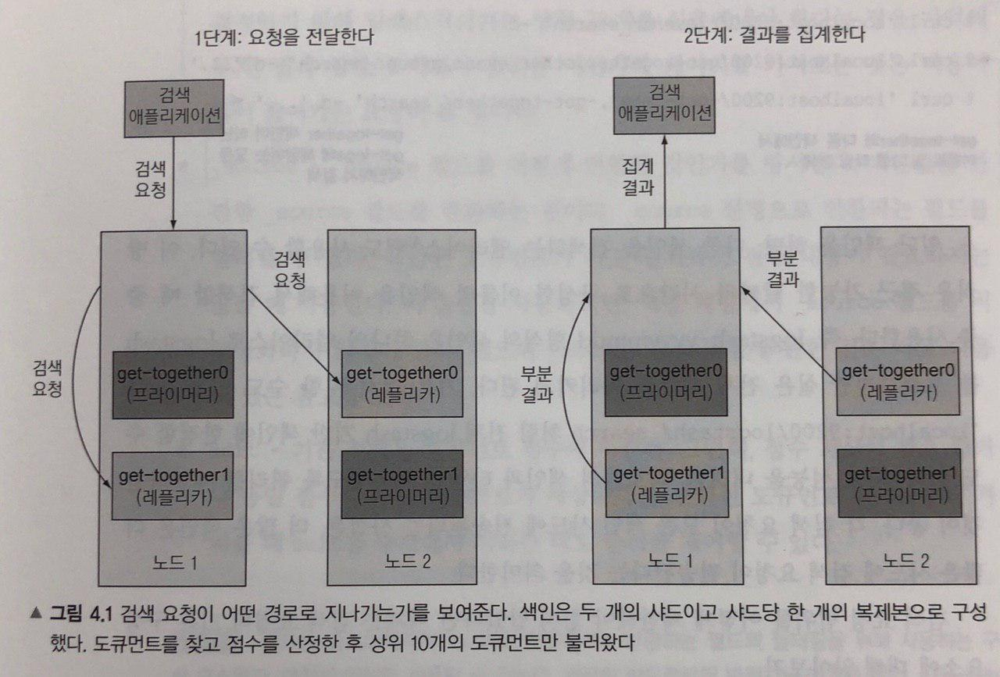

## 데이터 검색_Day1

### 데이터 검색 기본 API
 - GET 메서드를 이용하여 데이터를 검색한다.
 ~~~
 -XGET http://{host}:{port}/{index}/{type}/{documentid}?{param..}
 ~~~
 - ID로 document를 얻는것은 검색보다 훨씬 빠르고 자원측면에서도 저렴하다. 실시간으로 행해지며 색인작업이 끝나자마자 새로운 문서를 가져올 수 있디만 검색은 준 실시간이다. 기본값으로 매초 발생하는 리프레시를 기다려야함.
 - 어디를? : 특정 index의 특정type을 보게끔 지시할수 있지만 같은 index, 다수의 index, 혹은 모든 idex에서 여러 타입에 검색 할 수도 있다.
    - N개의 타입 검색
    ~~~
    -XGET http://{host}:{port}/{index}/{type1, type2, ..}/_search ...
    ~~~
    - 특정 index의 모든 type에 검색
    ~~~
    -XGET http://{host}:{port}/{index}/_search ...
    ~~~
    - N개의 index 검색
    ~~~
    -XGET http://{host}:{port}/{index1, index2}/_search ...
    ~~~
    - 모든 index 에서 검색
    ~~~
    -XGET http://{host}:{port}/_search ...
    -XGET http://{host}:{port}/_all/{type}/_search ...
    ~~~

 - 응답내용
    - 검색응답은 검색 기준과 일치하는 문서뿐 아니라 검색 성능이나 결과의 유사도를 확인하는 데 유용한 정보를 포함한다.
    
    - 만약 3개의 노드를 가지고 있는 클러스터가 있고, 각각은 하나의 샤드가 있고 복제가 없다. 하나의 노드가 내려가면, 어떤 데이터는 놓칠 수 있다.
    -> elasticsearch가 살아있는 샤드로부터 결과를 주고, 실패한 필드에 검색하기 위해 이용 불가능한 샤드 수를 보고한다.

 - 무엇을 어떻게?
    - 쿼리로 질의하기_query_string
    elasticsearch는 JSON 포맷으로 모든 검색 기준을 명시하도록 해준다.
    ~~~
    {uri} -d '
      {
        "query": {
          "query_string": {
            "query" : "elasticsearch",
            ... {query_string 옵션들}
          }
        }
      }
    '
    ~~~
    - term 쿼리    
    name필드에 "elasticsearch"라는 단어를 찾는다면
    ~~~
    {uri} -d '
      {
        "query": {
          "term": {
            "name": "elasticsearch"
          }
        }
      }
    '
    ~~~
    - term 필터
    elasticsearch는 이 필터와 일치하는 document인지 아닌지 알려주는 바이너리 비트 집합인 Bitset을 작성한다.
    ~~~
    {uri}/_search -d '{
        "query": {
          "filtered": {
            "query": {
              "match": {
                "title": "hadoop"
              }
            }
          },
          "filter": {
            "term": {
              "host": "andy"
            }
          }
        }
      }'
    ~~~

    ### 텀쿼리 vs 텀필터
    
    - 필터는 점수계산을 하지 않고 캐시로 쿼리 성능을 올릴 수 있다.
    자주 쓰는 필터라면 _cache옵션(true | false)을 사용하여 해당 필터를 캐싱 시킬 수 있다.

### 데이터 검색

### 데이터 검색_URI(쿼리)
- GET 메서드를 이용하여 데이터를 검색한다.
~~~
-XGET http://{host}:{port}/{index}/{type}/{documentid}?{param..}
~~~
 - param

 |param|설명|
 |---|---|
 |query| 점수 기반으로 최적의 document를 반환하거나 원치않는 document를 결과에서 걸러낸다. DSL 쿼리와 DSL 필터를 사용함.|
 |size| 반환할 document의 갯수 |
 |from| size와 함께 pagination에 사용 |
 |source| source 필드를 어떻게 반환할것인지 명시 default는 온전한 source필드를 반환하는것. |
 |sort| 정렬값으로, 기본 정렬은 document점수에 따른다. |
 - size 와 from 예시
  from=7, size=5라면 8, 9, 10, 11, 12번째 결과 반환, default값은 from=0, size=10
 - 예시> get-together index 에서 title하고 date를 검색하는데 오름차순으로 정렬한 결과에서 최초 10건만 반환하여라.
~~~
 -XGET 'localhost:9200/get-together/_search?sort=desc&_source=title,date'
~~~
 - q
 q=는 검색 요청에 쿼리를 제공하기 위해 사용한다.
 예시> elasticsearch단어를 제목 필드에서 찾겠다.
 ~~~
 {uri}?q=title:elasticsearch
 ~~~

### 데이터 검색_본문기반검색(쿼리)
 - 예제1> name과 date 필드를 반환
~~~
{uri}/_search -d '
  {
    "query": {
      "match_all": {}
    },
    "from": 10,
    "size": 10,
    "_source": ["name", "date"]
  }
'
~~~
 - 예제2 > 와일드카드, include, exclude, sort
~~~
{uri}/_search -d '
  {
    "query": {
      "match_all": {}
    },
    "from": 10,
    "size": 10,
    "_source": {
      "include": ["location.*", "date"],
      "exclude": ["location.geolocation"]
    },
    "sort": [
      {"created_on": "asc"},
      {"name": "desc"}
    ]
  }
'
~~~
 - 도큐먼트의 _source나 필드 중 어디에도 저장하지 않았다면, elasticsearch로부터 값을 조회할 수 없다.

### 복합쿼리, 복합필터 제공
 - bool 쿼리
    - must, must not, should
 - 범위 쿼리 파라미터
    - gt, gte, lt, lte

### 데이터 분석 단계
 ~~~
 share your experience with NoSql & big data technologies
 ~~~
 1. 문자 필터링 : 문자 필터를 이용해서 특정 문자를 다른 문자로 변환.
 & -> and
 ~~~
 share your experience with NoSql and big data technologies
 ~~~

 2. 텍스트를 토큰으로 분해 : 텍스트를 한 개 이상의 토큰의 집합으로 분해한다.
 일반적으로 표준 tokanizer 를 사용, 문자를 기반으로 text를 토큰으로 분리할 수도있음.
 ~~~
  | share |  your | experience | with | NoSql | and | big | data | technologies |
 ~~~

 3. 토큰 필터링 : 토큰 필터를 사용해서 개별 토큰을 변환한다. 입력으로 토큰을 가져와서 변경하거나 필요시에 더 많은 토큰을 추가하고 삭제한다.
 소문자화, 불용어(and..), 동의어 처리(technologies, tools)
 ~~~
 | share |  your | experience | with | nosql | big | data | tools |
 ~~~

 4. 토큰 색인 : 토큰을 색인에 저장한다.

### 검색을 실행하는 동안 분석
 - match와 match_phrase 쿼리는 검색하기 전에 분석을 수행하는데 반해 term과 terms 쿼리는 그렇지 않다. 

### 기타 ~
 - _source
 원본 document를 원래 형식 그대로 저장하기 위한 것이다. _source에 원본을 저장할지 여부는 셋팅가능.
 - _all
 _all로 검색할 때 elasticsearch는 어떤 필드가 일치하는지와 무관하게 검색 결과를 반환한다. 필드없는 URI로 검색을 실행하면 기본값 _all로 검색한다. 이 또한 셋팅 가능.
 - 프리픽스와 와일드카드 쿼리 지원
