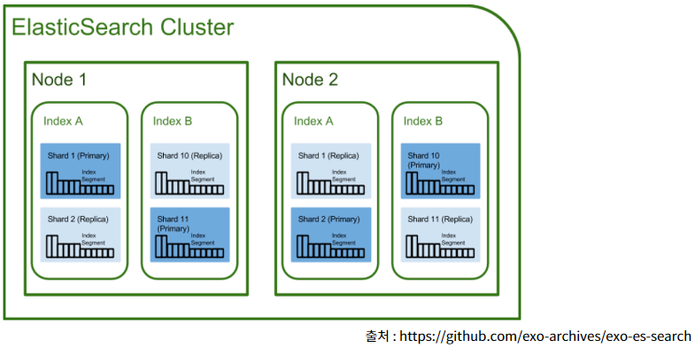

## 클러스터 관리

### 기본 설정 향상시키기(튜닝)
#### 색인 템플릿
 - 특정 템플릿을 만들어놓고 색인시 템플릿으로 사용
 - 균일한 데이터 저장 형태가 반복되서 나타나는 것이 확인되었을경우 유용하다.
 - RESTAPI로 설정할 수 있고 json파일로 저장 후 설정 가능하다.
 - 예시> 로그스태시가 새로운 이벤트를 포함하여 요청을 elasticsearch에 보낼 경우, 새로운 색인은 logstash-{날짜} 라는 이름으로 생성되고 문서의 타입은 자동으로 매핑될것이다.
 ~~~
 -XPUT {url}/_template/index -d '{
    "template": "logstash-*",  -> 색인 이름이 패턴에 매치되는 모든 색인에 이 템플릿을 적용한다.
    "settings": {
      ~
    },
    "mappings": {
      ~
    },
    "aliases": {
      ~
    }
   }'
 ~~~
 - 여러개의 템플릿을 중첩해서 쓸 수 있으며 높은 순서값("order" 설정값 사용)을 가진것이 낮은 순서값을 가진것을 오버라이딩한다.

### 할당인식 (Allocation Awareness)
 - 클러스터 topology 설계라는 개념
 - 데이터의 복제본이 어디에 위치할지에 대한 인지 상태.
 - elasticsearch가 클러스터에 레플리카 데이터를 잘 분배하도록 할 수 있다.
#### 샤드 기반 할당
 - 사용자 정의 파라미터를 통해 설정가능.
 - elasticsearch.yml 에서 설정가능
 ~~~
 cluster.routing.allocation.awareness.attributes : {rack, group, zone...}
 ~~~
 - 클러스터 내에서 샤드들을 rack 이라는 파라미터 인식을 사용하여 나눌 수 있다.
 - 원하는 네트워크 구성에 따라서 각 노드의 elasticsearch.yml에서 이 값을 원하는 값으로 수정할 수 있다.
 - 노드에 메타데이터로 설정
 ~~~
 node.rack: 1
 ~~~
 [클러스터할당전후_522p 그림11.1, 11.2]
 - 주와 레플리카 샤드가 같은 랙에 위치하는 문제점 해결가능

#### 강제 할당 인식
 - 사전에 값들의 분류를 이해하고 어떤 그룹에 속하는 레플리카의 수를 제한하고자할때 사용.
 - AWS에서 사용중
 - 다른 존이 다운되거나 접근 불가능할 경우에도 한 존에 있는 레플리카의 수를 제한한다. -> 다른 그룹에 레플리카가 과할당되는 위험을 줄일 수 있다.
 ~~~
 cluster.routing.allocation.arareness.attributes: zone
 cluster.routing.allocation.force.zone.values: us-east, us-west
 ~~~
 - 동부리전에 node.zone: us-east인 몇몇 노드를 시작 -> 서부 리전의 클러스터를 node.zone: us-west로 설정하여 시작한다면 us-east의 레플리카들이 여기로 할당될 것이다. node.zone: us-east인 노드에는 레플리카 샤드가 존재하지 않을것이다.

### 문제 상황 모니터링하기
#### 클러스터 상태 확인하기
[클러스터 상태_525p 예제 11.3]
~~~
 -XGET {url}/_cluster/health
~~~
 - relocating_shards : 0보다 크다면 elasticsearch가 장애복구나 더 좋은 균형상태를 유지하기 위해 샤드를 클러스터의 다른 노드로 이동시키고 있다는 뜻으로 이는 노드를 추가하거나 장애가 발생한 노드를 재시작, 노드제거할경우 일상적으로 발생하는 일시적인 현상
 - initializing_shards : 0보다 크다면 색인을 새로 생성하거나 노드를 재시작한경우
 - unassigned_shards : 0보다 크다면 할당되지 않은 레플리카들이 존재함.
 - status
 ~~~
 green : 정상
 yellow : 레플리카 샤드 유실, 클러스터 불안정. 정상적으로 시작되지 않았거나 작동하지 않는 노드들을 살펴보아야함.
 red : 심각! 클러스터에서 찾을수 었는 주 샤드가 있다. 하나 혹은 다수의 노드가 클러스터에서 유실되었을 가능성이 높음.
 ~~~
 [클러스터 문제상황 및 해결_527,528p]

#### CPU: 슬로우로그, 핫 스레드, 스레드 풀
 - CPU가 칠때! 블락된 대기 중인 스레드들로 인해 성능병목 확인.
##### 슬로우로그
 - 느린 작업들을 확인하기 위한 두가지 형태의 로그(슬로우로그, 색인로그)를 제공한다.
 - 둘다 default 비활성화
 - 로그 출력의 범위는 샤드레벨
 - 임계값을 정해놓고 임계값을 초과하는 검색과 조회 작업이 일어나면 로그를 남긴다.
~~~
index.search.slowlog~~ 설정값들로 설정 가능
~~~
##### 슬로우 색인 로그
 - 색인 요청의 병목 지점을 파악할 수 있다.
 - 임계값을 정해놓고 임계값을 초과하는 색인이 발생했을경우 로그를 남긴다.
 ~~~
 index.indexing.slowlog~~ 설정값들로 설정 가능
 ~~~
##### 핫 스레드 API
 - 핫한스레드
 - 어떤 용도로 스레드가 CPU를 몇% 먹고있는지 확인가능
 - 블락된 스레드들을 확인할 수 있는 블락 사용률이나 wating 상태에 있는 스레드들에 대한 대기 사용률 확인가능
 - default 500ms마다 elasticsearch는 정보 수집. 각각의 스택 트레이스에 대한 스냅샷을 떠놓음.
 - type, interval, threads 설정가능
 ~~~
 -XGET {url}/_nodes/hot_threads
 ~~~

##### 스레드풀
 - 각 노드는 스레드풀을 관리하고 있고 elasticsearch는 실행되고 있는 노드에서 최대한의 성능을 달성하기위해 스레드풀을 관리하려고 한다.
 - 스레드풀 설정들을 튜닝할 수 있으며 스레드 풀은 요청 종류에 따라 나누어진다.
 - 스레드 풀의 큐 사이즈나 벌크요청을 위한 스레드풀의 수를 늘릴 수 있다.
 ~~~
 threadpool.~~ 설정값들로 설정 가능
 ~~~
 - 고정 스레드풀 : 고정된 수의 스레드를 가지고 요청을 처리하고 대기중인 요청을 보관할 큐를 가지고 있음.
 - 캐시 스레드풀 : 무제한. 대기중인 요청이 있을 경우 새로운 스레드를 생성한다.

#### 메모리: 힙크기
 - elasticsearch의 집계와 필터링 작업은 메모리에 의해 제약을 받는 작업이다.
##### 힙크기
 - 어쨋든 elasticsearch는 JVM에서 동작하는 Application 이기때문에 JVM 설정에 영향을 받는다.
 - GC의 메모리 관리 작업에 의해 영향을 받는다.
 - 힙 크기를 설정할 때의 규칙!
  1. 최대 시스템 램의 50% : JVM에 너무 많이 할당하면 루씬이 빈번하게 사용하는 파일 시스템 캐시를 위한 메모리가 부족할 수 있다.
  2. 최대 32GB램 : JVM은 32G 이상 메모리가 할당된 경우 압축된 OOP(Object Ordinary Pointer)를 사용하지 않도록 동작이 변경된다. 다시말해 32G 이하고 힙을 사용할 경우 메모리 공간을 대략 절반 정도로 사용하게 된다는 뜻이다.   

#### 운영체제 캐시
 - elasticsearch와 루씬은 루씬 세그먼트가 불변 파일이라는 특성(한번만 쓰이고 여러번 읽힌다.)으로 인해 운영체제의 파일시스템 캐시를 적극적으로 사용한다.
 - 루씬은 인메모리 자료구조의 경우 기반의 운영체제 파일 시스템 캐시를 적극적으로 사용하도록 설계되었다.
 - 핫한 세그먼트를 빠른 접근이 가능하게 메모리에 상주시키도록 설계되어있다. -> 작은 색인은 운영체제에 의해 메모리에 통째로 캐싱되어 디스크를 사용하지 않고 빠르게 작업을 수행하게 될 확률이 높아진다.

#### 저장제한
 - 루씬은 데이터를 디스크에 불변 세그먼트로 저장하고, 각 세그먼트들에 대해 머지하는 형식으로 데이터를 저장한다. 머지작업은 큰 부하를 주지않지만 I/O성능이 낮은 시스템+머지+색인+검색 동시에 일어나면 성능저하 가능성이 있음.
 - elasticsearch는 제한기능을 제공하여 I/O를 얼마나 사용할지 조절할 수 있다.
 - 노드수준, 색인수준에서 사용할 수 있으며 I/O가 사용할 수 있는 최대 초당 바이트를 설정할 수 있다.
 ~~~
 indices.store.throttle.max_bytes_per_sec
 index.store.throttle.max_bytes_per_sec
 ~~~
 - 추천값은 없어보이고 알아서 잘 설정해서 써라.
 - 시스템의 I/O 대기 빈도가 높거나 성능이 저하되고 있다면 위의 설정값을 낮춰보자.

### 효율적으로 시스템 백업하기
 - 증분식 데이터 백업 방법을 제공한다.
 - 스냅샷은 논블로킹 작업이기 때문에 구동중인 시스템에서 수 행하요도 성능에 미치는 가시적인 영향은 없다.  
 - 파일 시스템 저장소를 정의한 후 스냅샷을 저장한다.
 ~~~
 -XPUT {url}/_snapshot/{repo} -d '{
    {옵션}
   }'
 ~~~
 - 복원
 ~~~
 -XPOST {url}/_snapshot/{repo}/{snapshotname}/_restore
 ~~~
 - 저장소 플러그인을 사용하여 저장가능
